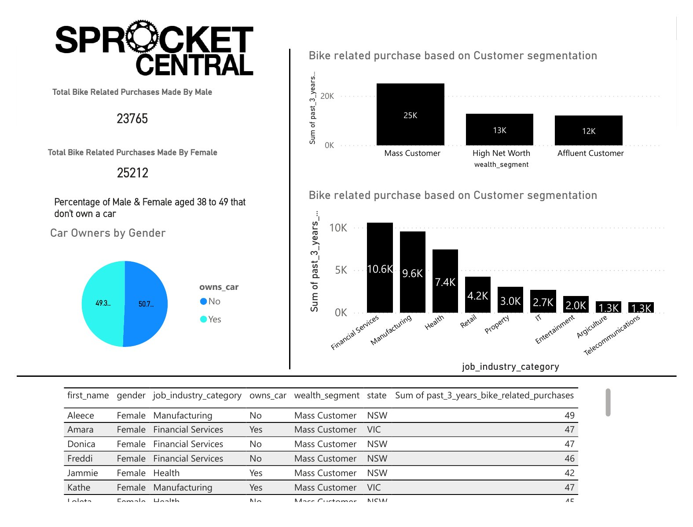
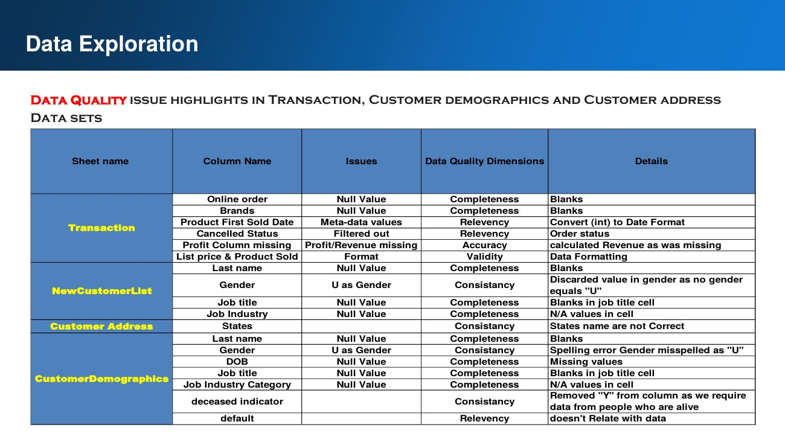
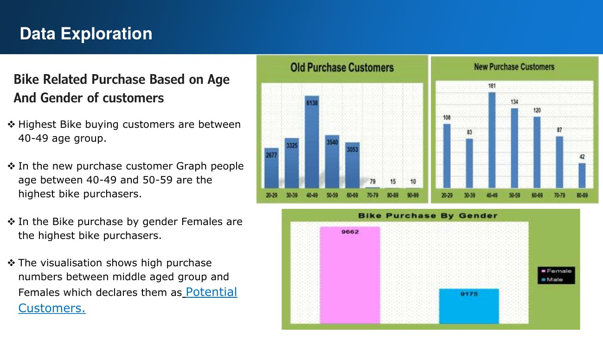
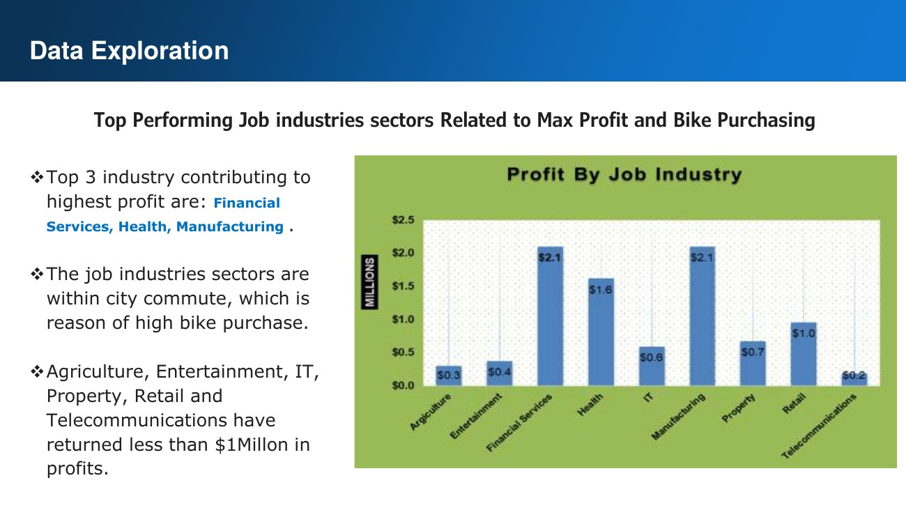
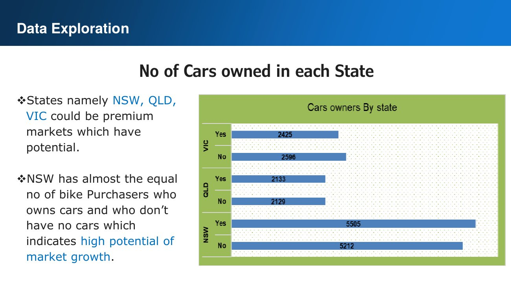
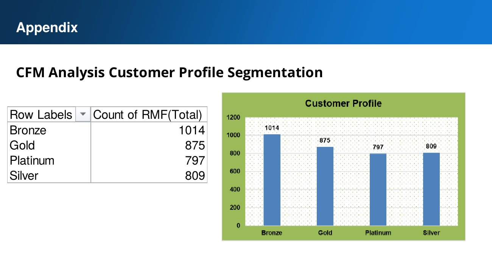
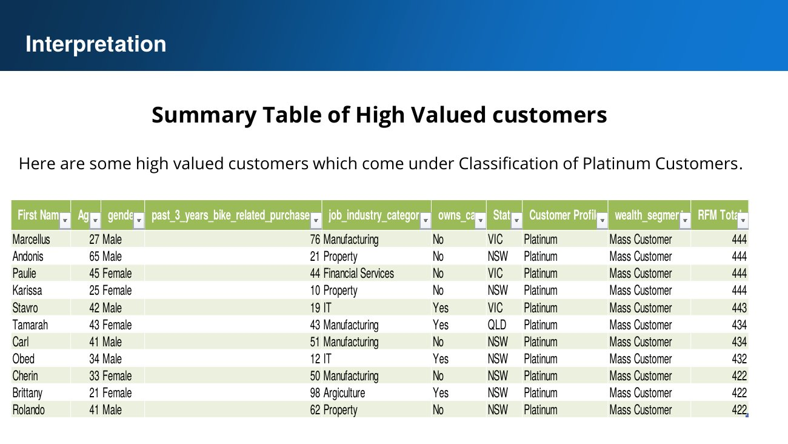

# KPMG AU – Data Analytics Consulting Virtual Internship



End-to-end customer analytics for **Sprocket Central Pty Ltd**, a bike and cycling-accessories retailer. Done for the **KPMG AU Data Analytics Consulting Virtual Internship on Forage** (completed October 2023).

**Goal:** Sprocket Central's marketing team wants to choose which **1,000 new customers** to target. To do that, I assessed data quality, analysed the existing customer base, and built a segmentation model and dashboard to rank the new customer list.

**Tools:** Python (pandas, NumPy, matplotlib, seaborn) · Excel (pivot tables, RFM scoring) · Power BI · PowerPoint

---

## Task 1 – Data Quality Assessment

I reviewed four datasets (Transactions, NewCustomerList, CustomerDemographic, CustomerAddress) against the standard data quality dimensions: **completeness, consistency, accuracy, relevancy, validity and uniqueness**.



Issues found and fixed in Python ([`data_cleaning.ipynb`](1-data-quality-assessment/data_cleaning.ipynb)):
- Null values in `online_order`, `brand`, `standard_cost`, `job_title` and `job_industry_category`
- Dates stored as floats (`product_first_sold_date`); converted to datetime
- Inconsistent gender labels (`F`, `Femal`, `M`, `U`); standardised
- Irrelevant or invalid columns (e.g. a corrupted `default` column and empty `Unnamed` columns); dropped
- Inconsistent state names, and records of deceased customers removed
- Missing profit; derived from list price minus standard cost

I also wrote an email to the client summarising the issues and next steps ([`email_to_client.docx`](1-data-quality-assessment/email_to_client.docx)).

## Task 2 – Data Insights & Customer Segmentation

<table><tr>
<td></td>
<td></td>
</tr><tr>
<td></td>
<td></td>
</tr></table>

**Key insights**
- **Age:** customers aged **40–49** make the most bike-related purchases. Among new customers, the 40–49 and 50–59 groups lead.
- **Gender:** women made more bike-related purchases than men (**25,212 vs 23,765**).
- **Industry:** **Financial Services, Health and Manufacturing** generate the most profit and purchases. Agriculture, Entertainment, IT, Property, Retail and Telecommunications each return less than $1M.
- **Location:** **NSW, QLD and VIC** are the premium markets. In NSW, car owners and non-owners are almost evenly split, which suggests growth potential for bikes.

**Model:** I segmented customers with **RFM (Recency, Frequency, Monetary) scoring** in Excel into **Platinum (797), Gold (875), Silver (809) and Bronze (1,014)** tiers, then applied the profile to rank the new customer list ([`KPMG_customer_segmentation_RFM_analysis.xlsx`](2-data-insights/KPMG_customer_segmentation_RFM_analysis.xlsx)).

**Target customer profile:** female, aged 38–49, working in Health, Financial Services or Manufacturing, and based in NSW or VIC.



Full presentation: [`Sprocket_Central_presentation.pdf`](2-data-insights/Sprocket_Central_presentation.pdf)

## Task 3 – Insights Dashboard (Power BI)

An interactive dashboard showing bike-related purchases by gender, wealth segment and job industry, car ownership, and a ranked table of high-value customers to target ([`Sprocket_Central_Dashboard.pbix`](3-dashboard/Sprocket_Central_Dashboard.pbix)).

---

## Repository structure

```
1-data-quality-assessment/   Raw data with quality notes, Python cleaning notebook, client email
2-data-insights/             Cleaned data, RFM segmentation workbook, presentation (PPTX + PDF)
3-dashboard/                 Power BI dashboard (PBIX + PDF)
images/                      Slides and dashboard screenshots
certificate/                 Forage completion certificate
```

## About this project
This was a virtual internship run by KPMG Australia on [Forage](https://www.theforage.com). It is not employment at KPMG. The Sprocket Central datasets were provided by the programme.

**Author:** Muhammad Usman Khan · [Portfolio](https://data-meta.github.io) · [LinkedIn](https://www.linkedin.com/in/muhammad-usman-khan-data-analyst/) · [GitHub](https://github.com/DATA-Meta)
